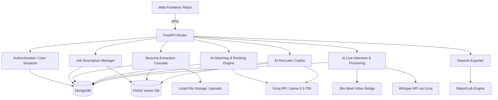

# HireIQ Recruitment OS: Complete Project Architecture & Developer Guide

This document provides a technical walkthrough of the HireIQ Recruitment OS platform. It details all subsystems including Authentication, Job Analysis, Resume Processing, AI Matching/Ranking, the Recruiting Copilot (Chatbot), Video/Audio Interviews with proctoring, and Reports Generation.

---

## System Architecture Overview

---

## 1. Authentication & Security
* **Files:** `backend/auth.py`, `backend/routes/auth_routes.py`
* **Technology:** OAuth2 with Password Bearer, JWT tokens, bcrypt password hashing.
* **Flow:**
  1. Recruiters register and log in to obtain a secure JSON Web Token (JWT).
  2. Endpoints verify recruiter identity using a dependency injection model `Depends(get_current_user)`.
  3. Session management ties candidates and jobs to the authenticated user's organization.

---

## 2. Job Description Management
* **Files:** [backend/routes/jobs.py](file:///d:/Job_resume_ranker-main/backend/routes/jobs.py), `backend/resume_parser.py`
* **Flow:**
  1. The recruiter inputs raw Job Description (JD) details.
  2. The parser triggers `parse_job_description(text)` to extract:
     * **Skills:** Heuristically matches words against `SKILLS_DB` to separate required vs. preferred.
     * **AI-extracted Prerequisites:** Calls `parse_jd_with_llm` using `llama-3.3-70b-versatile` to extract target experience levels, certifications, and required projects.
  3. The parsed structure is saved to the MongoDB `jobs` collection.
  4. FAISS indices are updated asynchronously via `index_job()` to enable vector semantic searches.

---

## 3. Resume Upload & Cascade Parser
* **Files:** [backend/main.py](file:///d:/Job_resume_ranker-main/backend/main.py) (routes), [backend/resume_parser.py](file:///d:/Job_resume_ranker-main/backend/resume_parser.py)
* **Flow:**
  1. **Upload:** Multiple resumes are sent to `POST /resumes/upload`. Files are saved under `./uploads` with names prefixed with a unique UUID hash (`[uuid]_[filename]`).
  2. **Format Handlers:**
     * **PDF:** Parsed line-by-line via `pypdf` (`PdfReader`).
     * **DOCX:** Extracted via `mammoth` (HTML/Text converter).
  3. **Multi-Strategy Cascade:**
     * **Personal Info Extraction:** Extracts candidate name, email, and phone utilizing regex matching, spaCy NER (`PERSON` tag), and email-prefix cross-referencing.
     * **Skill Extraction:** Performs case-insensitive matches against `SKILLS_DB` with synonym mapping and fuzzy lookup.
     * **Timeline Compilation:** Aggregates work experiences, normalizes dates, and calculates total experience.
     * **LLM Enhancer:** Calls `parse_resume_with_llm` on Groq to gather structured education, timeline events, and project names.
  4. **Storage:** Saves candidates in the MongoDB `candidates` collection with status `"pending"`.
  5. **FAISS Indexing:** Embeds name and text using `all-MiniLM-L6-v2` and updates candidate metadata.

---

## 4. AI Matching & Ranking Engine
* **Files:** [backend/matching.py](file:///d:/Job_resume_ranker-main/backend/matching.py)
* **Scoring Rules (Weighted 100% Total):**
  * **Skills Match (40%):** Computes exact, semantic (embedding cosine similarity $\ge$ 0.72), and token fuzzy match scores.
  * **Experience Match (25%):** Compares total years of candidate experience with the job requirement. If lower, a penalty ratio is applied.
  * **Semantic Similarity (15%):** Cosine similarity between document-level embeddings of the resume and the JD.
  * **Project Match (10%):** Detects if candidate project logs match requirements defined in the JD.
  * **Certifications (5%):** Validates if candidate holds credentials requested in the JD.
  * **Resume Quality (5%):** Deducts points for short text, low extraction confidence, or missing contact info.
* **Global Penalties:**
  * **Skill Gap Penalty:** Deducts points if required skills are missing (graded at >30%, >50%, or >70% gaps).
  * **Experience Deficit:** Deducts `10` points if candidate experience is below 50% of the JD minimum.
  * **Short Resume:** Deducts `10` points if content length is under 500 characters.
  * **Low Extraction Confidence:** Deducts `8` points if LLM parser confidence is below 50%.
* **AI Summary & Verdict:** Calls Groq's Llama-3.3 model to generate:
  * Strengths, Weaknesses, and Risks (minimum of 3 bullet points each).
  * A Recommendation Verdict: *Strong Hire*, *Good Match*, *Moderate Match*, *Hold*, or *Reject*.
  * Onboarding estimates and focus areas.

---

## 5. AI Recruitment Copilot (Chatbot)
* **Files:** [backend/routes/chat.py](file:///d:/Job_resume_ranker-main/backend/routes/chat.py)
* **API Endpoints:** `POST /chat/query` (blocking) and `POST /chat/stream` (Streaming responses).
* **Processing Pipeline:**
  1. **Intent Classification:** Classifies queries using regex patterns or semantic cosine similarity against anchor phrases. Supported intents:
     * `top_candidates`: Top candidates for a specific job.
     * `candidate_search`: Skill/experience queries (e.g. "React developers with 3 years").
     * `experience_filter`: Experience checks.
     * `status_query`: Status filters (e.g. "shortlisted candidates").
     * `analytics`: Average scores, experience, or skill distribution queries.
     * `candidate_profile`: Summary of a candidate.
     * `candidate_comparison`: Side-by-side comparison.
     * `hiring_recommendation`: Direct hire recommendations.
     * `why_low_rank`: Explanation of low scores.
     * `interview_performance`: Live interview evaluation results.
     * `generate_questions`: Interview questions generation.
  2. **DB Query & RAG Assembly:** Constructs queries dynamically from MongoDB collections.
  3. **Response Generation:** Injects MongoDB data as context into Groq Llama-3 (`llama-3.3-70b-versatile`) or Cohere command-r fallback to formulate conversational responses.

---

## 6. AI Voice & Video Interview Platform
* **Files:** [backend/routes/interviews.py](file:///d:/Job_resume_ranker-main/backend/routes/interviews.py), [backend/routes/audio.py](file:///d:/Job_resume_ranker-main/backend/routes/audio.py), `backend/services/ai_analysis.py`
* **Core Components:**
  * **Interview Scheduler:** Schedules interviews, books Jitsi Meet rooms, and sends email notifications.
  * **Video Proctoring:** Candidate webcams log looking-away patterns, absence, or multiple faces. Browsers log tab-switching and copy-paste violations. Calculates a real-time **Integrity Score**.
  * **Audio Transcription:** Audio streams are uploaded in chunks and transcribed via cloud Whisper (`whisper-large-v3` on Groq).
  * **Speaker Diarization (`diarize_segment`):** Classifies speech as "Interviewer" or "Candidate" using dialogue-turn heuristics.
  * **Speaking Distribution:** Tracks candidate-to-interviewer speech ratios.
  * **Interview Question Generator:** Suggests customized interview questions based on job description and candidates' skill gaps.
  * **AI Interview Analysis:** Evaluates candidates post-interview, generating communication, confidence, and technical understanding metrics.

---

## 7. Reports & Analytics Exporters
* **Files:** [backend/reports.py](file:///d:/Job_resume_ranker-main/backend/reports.py)
* **Features:**
  * **CSV Exporter:** Generates structured spreadsheets containing score breakdowns, skill matches, experience, contact details, and recruiter feedback.
  * **PDF Screening Report:** Creates an executive overview of screening metrics, color-coded candidate statuses, and AI summaries using ReportLab.
  * **PDF Interview Intelligence Report:** Formats interview outcomes, session statistics, speaking ratios, communication scores, proctoring violations, and full transcripts.

---

## 8. Directory Map

* **`backend/`**
  * `auth.py`, `database.py`, `matching.py`, `resume_parser.py`, `reports.py` (Core modules)
  * `routes/`
    * `jobs.py`, `candidates.py`, `chat.py`, `interviews.py`, `audio.py` (API Routers)
  * `services/`
    * `vector_store.py` (FAISS sync), `email_service.py` (Notifications)
* **`frontend/`** (React App)
  * `src/pages/`
    * `Compare.jsx` (Side-by-side screening), `Dashboard.jsx`, `InterviewRoom.jsx` (Jitsi integrations)
  * `src/components/`
    * `InterviewAnalytics.jsx`, `InterviewPrepCard.jsx`
