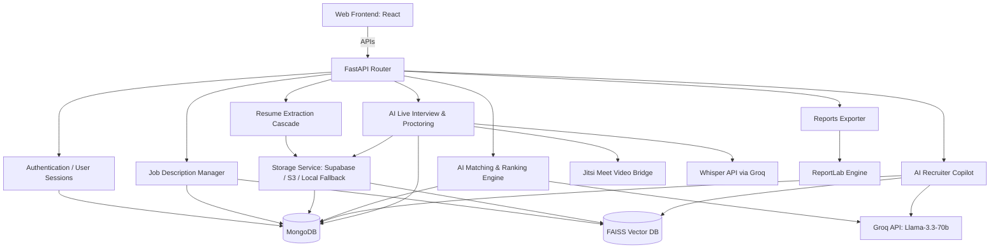

# HireIQ Recruitment OS: End-to-End System Walkthrough & Documentation

This document provides a comprehensive, developer-friendly guide to the architecture, workflows, and inner workings of the HireIQ Recruitment OS. It covers all core modules: Authentication, Job Analysis, Resume Processing, AI Matching/Ranking, Chatbot Copilot, Video/Audio Interviews with proctoring, Email/Notification service, and PDF/CSV Exporter.

---

## 1. System Architecture Overview

---

## 2. Dynamic End-to-End Workflows

### Phase A: Job Description (JD) Creation & Analysis
1. **Recruiter Inputs Raw JD:** Recruiter creates a job posting in the React UI (`/jobs`).
2. **Prerequisite Extraction (FastAPI backend/routes/jobs.py):**
   * The backend processes raw text using `parse_job_description(text)`.
   * **Skill Extraction:** Heuristically matches words against a normalized `SKILLS_DB` to separate required vs. preferred.
   * **LLM Extraction:** Calls `parse_jd_with_llm` on Groq (`llama-3.3-70b-versatile`) to extract experience level targets, certifications, and required projects.
3. **Database Insertion:** Saved to the MongoDB `jobs` collection.
4. **Vector Sync:** Triggers `index_job()` to update the FAISS vector database with sentence-level embeddings.

### Phase B: Resume Upload & Precision Parsing
1. **File Upload & Cloud Storage (backend/main.py):**
   * Multiple resumes (PDF/TXT) are sent to `POST /resumes/upload`.
   * The backend extracts text in memory for parsing and writes a temporary local file buffer.
   * **Cloud Upload Integration:** The temporary file is uploaded via `CloudStorageService` to **Supabase Storage** (or AWS S3) if credentials are set in `.env`.
   * **Local Cleanup:** If uploaded to Supabase or S3, the local copy is instantly deleted to prevent storing physical files on the server.
   * **Local Fallback:** If cloud configurations are absent, it safely falls back to local storage inside `./uploads/resumes/` and returns the local URL.
2. **Text Extraction:**
   * **PDF:** Parsed line-by-line using PyPDF `PdfReader`.
   * **TXT:** Read using UTF-8 / CP1252 decoder fallback.
3. **Multi-Strategy Cascade Parser (backend/resume_parser.py):**
   * **Personal Info Extraction:** Extracts candidate name, email, and phone utilizing regex, spaCy NER (`PERSON` tag), and email-prefix cross-referencing.
   * **Name Guard System:** 
     * Uses `_LINKEDIN_LINE_RE` and `_JOB_TITLE_RE` to filter out LinkedIn/GitHub artifacts (like "Link Edin") and job titles (like "Marketing Manager", "Edtech Leader") from the name candidates.
     * Prevents short line merging from collapsing invalid names containing email run-ons (e.g., rejecting name candidates containing strings like "shividhamijagmailcom").
   * **Skill Extraction:** Looks up case-insensitive matches against `SKILLS_DB` and handles synonym normalizing. Targets specific skills sections like "Key Skills" or "Areas of Expertise".
   * **Timeline & Experience:**
     * **Stage 0 (Highest Priority):** Targets the "Work Experience" / "Professional Experience" section text specifically, parses date ranges, and sums durations.
     * **Stage 1 (Summary Scan):** Scans the Professional Summary section for explicit years statements (e.g. "X+ years of experience").
     * **Stage 2 (Full-text Scan):** Gathers all valid date ranges in the document.
     * **Stage 3 (AI Fallback):** Calls Cohere `command-r-plus` if API credentials are provided.
   * **LLM Parser (backend/services/llm_parser.py):**
     * Calls Groq (`llama-3.3-70b-versatile` / `llama-3.1-8b-instant`) with 8,000 character context windows.
     * Extracts canonical structure (companies, education, projects, timeline, certifications) with strict JSON output validation.
4. **Storage:**
   * Saves candidate document (storing the Supabase URL or local fallback URL in `resume_path`) in MongoDB `candidates` collection.
   * Updates FAISS index with candidate name/skills/resume text vector embeddings.

### Phase C: AI Matching, Ranking, & Decisioning
1. **Reranking Trigger:** Once a JD is present and resumes are uploaded, recruiters trigger `POST /rerank-all-candidates`.
2. **Weighted Scoring (backend/matching.py):**
   * **Skills Match (40%):** Computes exact matching, cosine similarity of skill embeddings ($\ge$ 0.72), and token fuzzy scores.
   * **Experience Match (25%):** Compares candidates' total experience with JD requirements.
   * **Semantic Similarity (15%):** Cosine similarity between entire resume embedding and JD embedding.
   * **Project Match (10%):** Matches candidate project logs to job description requirements.
   * **Certifications (5%):** Validates if candidate holds credentials requested in the JD.
   * **Resume Quality (5%):** Deducts points for extremely short text, low extraction confidence, or missing contact info.
3. **Global Penalties & Rules:**
   * **Skill Gap:** Penalties for missing critical skills.
   * **Experience Deficit:** Deducts `10` points if candidate experience is below 50% of JD min.
   * **Short Resume:** Deducts `10` points if content length is under 500 characters.
   * **Low LLM Confidence:** Deducts `8` points if LLM parser confidence is below 50%.
4. **AI Summary Generation (backend/services/hiring_summary.py):**
   * Calls Groq to generate a professional assessment:
     * **Strengths:** 3 evidence-based points.
     * **Weaknesses/Gaps:** 3 detailed points.
     * **Risks:** Potential risks (e.g., job hopping).
     * **Recommendation Verdict:** *Strong Hire*, *Good Match*, *Moderate Match*, *Hold*, or *Reject*.
     * **Onboarding & Level Estimates:** (e.g., "Productivity: 1-2 weeks", "Level: Senior").

### Phase D: AI Recruiter Copilot (Chatbot)
* **Files:** `backend/routes/chat.py`
* **API Endpoints:** `POST /chat/query` (blocking) and `POST /chat/stream` (Streaming responses).
* **Processing Pipeline:**
  1. **Intent Classification:** Classifies queries using semantic cosine similarity or regex matching against anchor phrases. Supported intents:
     * `top_candidates`: Returns top rankers for a job.
     * `candidate_search`: Searches skills/experience (e.g., "Python developers in Bangalore").
     * `analytics`: Average scores, experience, or skill distribution queries.
     * `candidate_profile`: Summary of a candidate.
     * `candidate_comparison`: Side-by-side comparison of selected candidates.
     * `why_low_rank`: Explanation of low scores.
     * `interview_performance`: Live interview evaluation results.
     * `generate_questions`: Suggests questions for recruiter review.
  2. **DB Query & RAG Assembly:** Queries MongoDB collections based on intent, fetches candidates/jobs, and creates local context.
  3. **Response Generation:** Injects MongoDB data as context into Groq Llama-3 (`llama-3.3-70b-versatile`) to formulate conversational responses.

### Phase E: Dynamic Mail & Interview System
* **Files:** `backend/services/email_service.py`, `backend/routes/interviews.py`
* **Flow:**
  1. **Scheduling & Invite:**
     * Recruiters schedule an interview via UI. The backend books a Jitsi Meet room.
     * **Dynamic Mailer:** Calls `send_email()` to notify the candidate. SMTP config is dynamically loaded from `.env` (using Fernet encryption key validation).
     * Sends custom HTML templates:
       * **Invite Template (`get_interview_scheduled_template`):** Contains Jitsi link, date, time, and instructions.
       * **Status Template (`get_status_update_template`):** Automated status updates (applied, shortlisted, rejected).
       * **Reminders (`get_reminder_template`):** Emailed to candidate and recruiter minutes before the call.
  2. **Proctored Jitsi Interview Room:**
     * Jitsi Meet is embedded in the frontend React app.
     * **Video Proctoring:** Candidates' webcams log looking-away patterns, absence, or multiple faces. Calculates a real-time **Integrity Score**.
     * **Browser Proctoring:** Logs tab-switching and copy-paste violations.
     * **Audio Transcription:** Streams audio in chunks to Whisper API (`whisper-large-v3` on Groq).
     * **Speaker Diarization (`diarize_segment`):** Classifies speech as "Interviewer" or "Candidate" using dialogue-turn heuristics.
     * **Speaking Distribution:** Tracks candidate-to-interviewer speech ratios.
     * **AI Post-Interview Analysis:** Generates communication, confidence, and technical understanding metrics stored in MongoDB.

### Phase F: Reports & Analytics Exporters
* **CSV Exporter (`backend/reports.py`):** Generates structured spreadsheets containing score breakdowns, skill matches, experience, contact details, and recruiter feedback.
* **PDF Screening Report:** Creates an executive overview of screening metrics, color-coded candidate statuses, and AI summaries using ReportLab.
* **PDF Interview Intelligence Report:** Formats interview outcomes, session statistics, speaking ratios, communication scores, proctoring violations, and full transcripts.

---

## 3. Database Architecture (MongoDB Collections)

* **`users`:** Account credentials, names, and session states.
* **`jobs`:** Title, company, location, raw description, parsed skills, prerequisites, and FAISS vector index status.
* **`candidates`:** 
  * Name, email, phone, location (defaults to **Bengaluru** if missing).
  * Technical/soft skills, education, projects, certifications, and parsed raw text.
  * AI scores (skills, experience, semantic, project, quality, certification, overall match %).
  * AI verdict, strengths, weaknesses, risks, and pipeline status.
* **`interviews`:** Schedule details, Jitsi meet links, proctoring logs, Whisper transcripts, and post-interview communication scores.

---

## 4. Summary of Recent Improvements

1. **Supabase & Cloud Storage Engine:** Upgraded file handling to save interview recordings and candidate resumes directly to Supabase storage buckets (or AWS S3). If cloud uploads succeed, the system automatically purges temporary local files on the server to maintain a zero local disk footprint. Added dynamic RedirectResponses in candidate routes to redirect document requests directly to Supabase.
2. **Anti-Hallucination Parser Rules:** Fixed issues where LinkedIn markers ("Link Edin") and job titles were incorrectly extracted as candidate names.
3. **Aggregated Experience Timelines:** Implemented Stage 0 extraction for Work/Professional Experience sections specifically, resolving zero-experience errors on complex formats.
4. **Bengaluru Fallback Integration:** Unified frontend fallback location to 'Bengaluru' instead of 'Remote'.
5. **Professional UI Cleanup:** Safely removed all conversational emojis from cards, buttons, and headers across the React source files, creating a sleek, recruiter-first experience.
6. **SMTP Mail Resilience:** Fixed NameError crashes during uploads and strengthened the email template validation logic.
